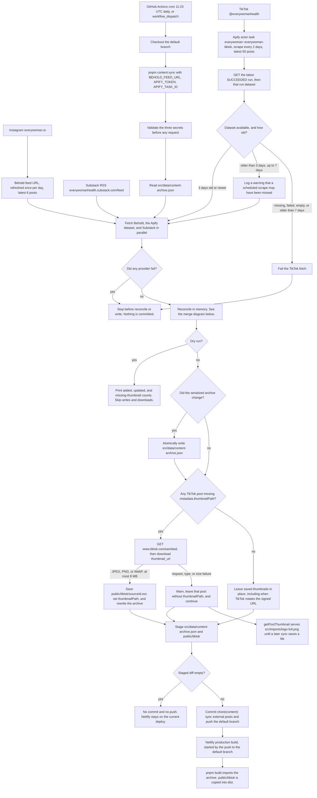
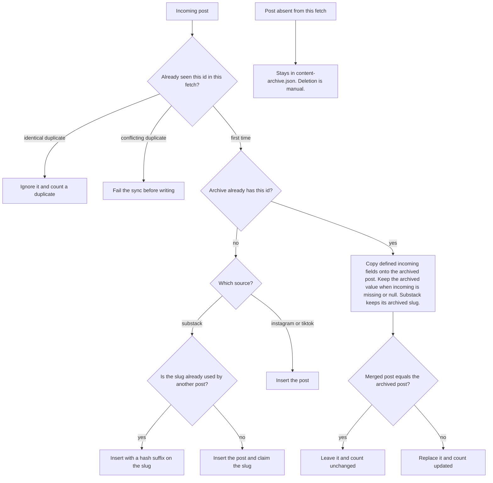

# Content archive pipeline

How [`src/data/content-archive.json`](../src/data/content-archive.json) is built, and how that build reaches the Netlify site.

Behold refreshes an Instagram feed of the **latest 6 posts once per day**. The Apify actor task scrapes TikTok **once every 2 days**. Those schedules live in Behold and Apify. This repo only reads their latest results. Substack posts come from Substack's [RSS feed](https://everywomanhealth.substack.com/feed) and don't have a separate service to collate content updates. The synchronizer is [`scripts/content/`](../scripts/content/).

## Pipeline

The GitHub Action is [`.github/workflows/sync-content.yml`](../.github/workflows/sync-content.yml). It commits with `github-actions[bot]` only when the archive JSON or `public/tiktok/` changed. The workflow has no Netlify deploy hook. A push to the default branch, including this bot commit or a manual one, is what starts the production build. A sync that exits early, a dry run, or a run with an empty diff leaves the live site as it is.

## Merge into the archive

Reconciliation in [`scripts/content/reconcile.ts`](../scripts/content/reconcile.ts) matches on `id`, which is `source:sourceId`. The archive is append-only: posts that fall out of a feed stay until someone deletes them by hand.

After reconcile, posts are sorted by `publishedAt` descending, then by `id`. The archive file is rewritten only when that serialized JSON differs from the file on disk.
